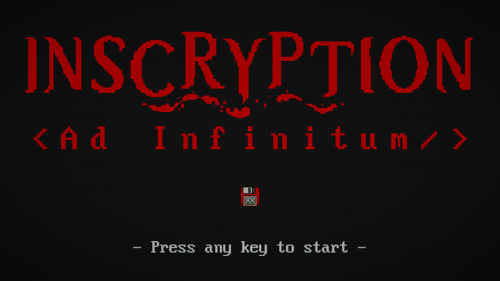

> [!IMPORTANT]
> The game is still under development and no feature is ensured to be permanent.

# Inscryption: Ad Infinitum

This is the source code for the unofficial, fan-made _Inscryption: Ad Infinitum_ spinoff derived from [_Inscryption_](https://www.inscryption.com/). All rights reserved to Daniel Mullins.

## Getting started

### Opening the game

Go to \*[link]()\* to open the game and/or install it on your device.

### Installation

* iOS: `Open Ad Infinitum on Safari > Share the webpage > ⊞ Add to Home Screen > Add`. You should see _Inscryption: Ad Infinitum_ in your homescreen.

* Android: `Open Ad Infinitum on Chrome > Open the kebab menu (⋮) > Add to Home screen > Add`. You should see _Inscryption: Ad Infinitum_ in your homescreen.

## Project Aim

The aim of _Inscryption: Ad Infinitum_ is to extend the original concept of _Inscryption_'s original DLC, _Kaycee's Mod_, and turn it into a truly endless, arcade-style experience. In the original DLC, your run would be forced to end once you defeated the four bosses. _Ad Infinitum_ will, instead, give you another set of four bosses again, and again... the final score of a run will be calculated from the amount of encounters beaten and the quality of your deck. 

### Why?

Why take this much effort (especially knowing I'm an amateur front-end developer) into ths project? Because I love Inscryption's mechanics and lore and I can't get enough of it, not to mention I got the original for PC and wanted to have a portable version of Act I. I also like to give myself far too complex problems.

## Specifications

### Built with

### Changelog

|  **Version (v)**  |     **Code name**     | **Description**                                              |
| :---------------: | :-------------------: | ------------------------------------------------------------ |
| 0.0.0 (_Current_) | _Initial development_ | Initial research on card creation mechanisms with `Angular`. |

### Acknowledgments

* [**Course on Angular** by Jeff Delaney (_aka Fireship_)](https://fireship.io/courses/angular/).
* [**Tutorials on TypeScript** by Jeff Delaney (_aka Fireship_)](https://fireship.io/tags/typescript/).
* [**Scanlines effect** by Mehdi (_aka Meduzen_)](https://codepen.io/meduzen/pen/zxbwRV).